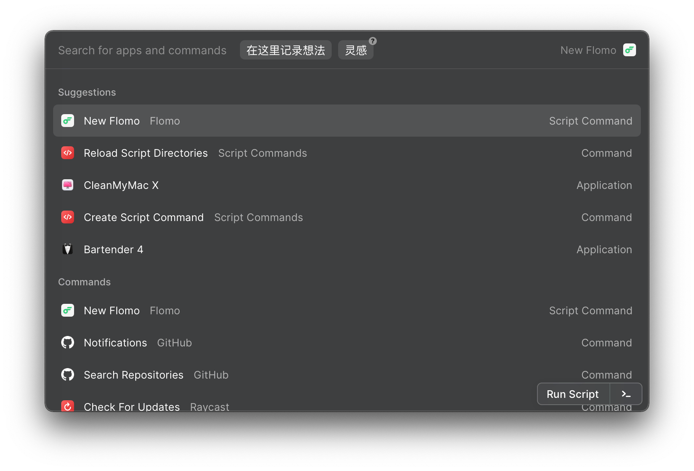

# Raycast Flomo

## Install raycast-flomo

Clone or download this repo, then add it to your Script Directories.

<https://github.com/raycast/script-commands#install-script-commands>

## Dependencies

### jq

raycast-flomo uses [jq](https://stedolan.github.io/jq/) to process  json.

- Use [Homebrew](http://brew.sh/) to install jq 1.6 with `brew install jq` .
- Use [MacPorts](https://www.macports.org/) to install jq 1.6 with `port install jq` .
- jq 1.6 binary for [64-bit](https://github.com/stedolan/jq/releases/download/jq-1.6/jq-osx-amd64).

If you don't want to install [jq](https://stedolan.github.io/jq/) , you can use the bit file in this repo.

- Change all keywords `jq` to `./jq` in `new-flomo.sh` .
- Run `chmod +x jq` in `raycast-flomo` .

## Others

You can find more script commands [here](https://github.com/raycast/script-commands).

Thanks to [Raycast](https://raycast.com) , [jq](https://stedolan.github.io/jq/) , [flomo](https://flomoapp.com/) .